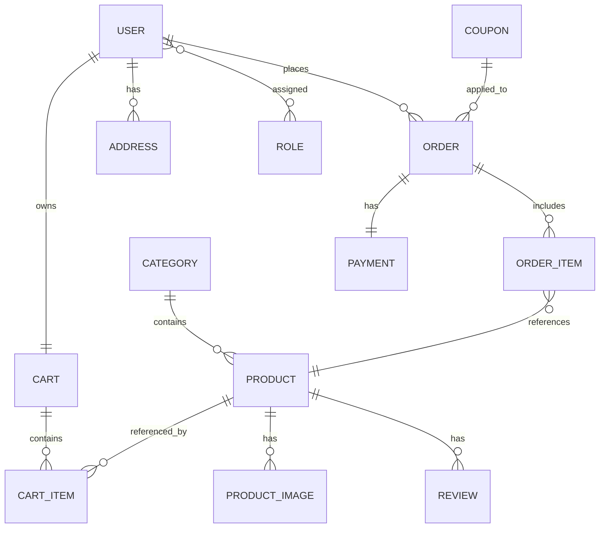

# Ecommerce Application — ER Diagram

Project documentation: entity relationships and descriptions for the e-commerce domain.

---

## Table of contents

* [Entity Relationships (text)](#entity-relationships-text)
* [Entity descriptions](#entity-descriptions)
* [High-level ASCII ER diagram](#high-level-ascii-er-diagram)
* [Mermaid ER diagram (editable)](#mermaid-er-diagram-editable)
* [Notes](#notes)

---

## Entity Relationships (text)

```
User (1) ── (M) Order
User (1) ── (1) Cart
Cart (1) ── (M) CartItem
Product (1) ── (M) CartItem

Category (1) ── (M) Product
Product (1) ── (M) ProductImage
Product (1) ── (M) Review

Order (1) ── (M) OrderItem
OrderItem (M) ── (1) Product

Order (1) ── (1) Payment
User (1) ── (M) Address

User (M) ── (M) Role

Coupon (1) ── (M) Order   (Optional)
```

---

## Entity descriptions

### User

* `User` can place many `Order`s (1 → M).
* `User` has one active `Cart` (1 → 1).
* `User` can have many `Address` entries (1 → M).
* `User` ↔ `Role` is many-to-many (via `user_roles` join table).

### Order

* Belongs to one `User`.
* Has many `OrderItem`s (1 → M).
* Has one `Payment` (1 → 1).
* Optionally linked to a `Coupon`.

### Cart

* One `Cart` per `User` (1 → 1).
* Cart contains many `CartItem`s (1 → M).

### CartItem

* Links a `Cart` to a `Product`.
* Holds quantity, price-at-addition, etc.

### Product

* Belongs to one `Category`.
* Has many `ProductImage`s (1 → M).
* Has many `Review`s (1 → M).
* Referenced by `OrderItem` and `CartItem`.

### Category

* Contains multiple `Product`s (1 → M).

### Review

* Each `Review` belongs to one `Product`.
* Optionally link `Review` → `User` if user reviews are required.

### OrderItem

* Each `Order` contains multiple `OrderItem`s.
* Each `OrderItem` references exactly one `Product`.

### Payment

* One `Payment` per `Order`.
* Store payment status, method, provider transaction id.

### Address

* A `User` can have multiple saved `Address`es.

### Role

* Role records (e.g., `USER`, `ADMIN`).
* Many-to-many with `User` through join table.

### Coupon (optional)

* One `Coupon` can be used by many `Order`s (1 → M).
* Store code, discount type, expiry, usage limits.

---

## High-level ASCII ER diagram

```
User ──< Order ──< OrderItem >── Product >── ProductImage
  │            │
  │            └── Payment
  │
  ├── Cart ──< CartItem >── Product
  │
  ├── Address
  │
  └── Role >──< User  (Many-to-Many)

Category ──< Product ──< Review

Coupon ──< Order  (optional)
```

---

## Mermaid ER diagram (editable)



> Copy the mermaid block into GitHub README or a mermaid renderer to visualize.

---

## Notes


---
