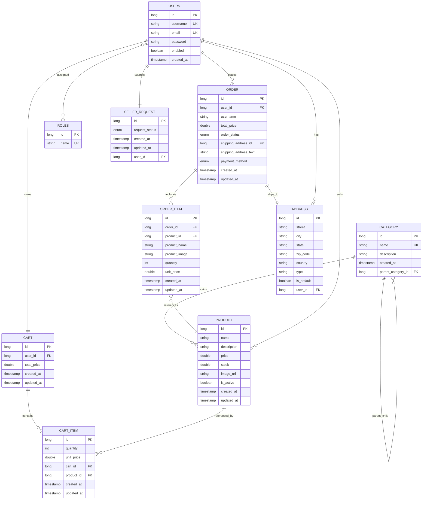

# Ecommerce Application — ER Diagram

Project documentation: entity relationships and descriptions for the e-commerce domain.

---

## Table of contents

* [Entity Relationships (text)](#entity-relationships-text)
* [Entity descriptions](#entity-descriptions)
* [High-level ASCII ER diagram](#high-level-ascii-er-diagram)
* [Mermaid ER diagram (editable)](#mermaid-er-diagram-editable)
* [Database Schema Details](#database-schema-details)
* [Notes](#notes)

---

## Entity Relationships (text)

```
Users (1) ── (M) Order
Users (1) ── (1) Cart
Cart (1) ── (M) CartItem
Product (1) ── (M) CartItem

Category (1) ── (M) Product
Category (1) ── (M) Category (self-referencing for hierarchy)

Order (1) ── (M) OrderItem
OrderItem (M) ── (1) Product

Users (1) ── (M) Address
Users (M) ── (M) Roles (via user_roles join table)

Users (1) ── (1) SellerRequest
Users (1) ── (M) Product (as seller)
```

---

## Entity descriptions

### Users

* `Users` can place many `Order`s (1 → M).
* `Users` has one active `Cart` (1 → 1).
* `Users` can have many `Address` entries (1 → M).
* `Users` ↔ `Roles` is many-to-many (via `user_roles` join table).
* `Users` can have one `SellerRequest` (1 → 1).
* `Users` (as seller) can have many `Product`s (1 → M).

### Order

* Belongs to one `Users`.
* Has many `OrderItem`s (1 → M).
* Has one `Address` as shipping address (1 → 1).
* Contains snapshots of product data for historical accuracy.

### Cart

* One `Cart` per `Users` (1 → 1).
* Cart contains many `CartItem`s (1 → M).
* Tracks total price of all items.

### CartItem

* Links a `Cart` to a `Product`.
* Holds quantity, unit price at time of addition.
* Maintains creation and update timestamps.

### Product

* Belongs to one `Category`.
* Belongs to one `Users` (seller).
* Referenced by `OrderItem` and `CartItem`.
* Contains stock quantity and pricing information.
* Has active/inactive status.

### Category

* Contains multiple `Product`s (1 → M).
* Supports hierarchical structure via self-referencing relationship.
* Can have parent and child categories.

### OrderItem

* Each `Order` contains multiple `OrderItem`s.
* Each `OrderItem` references exactly one `Product`.
* Contains snapshots of product name and image.
* Tracks quantity and unit price at time of order.

### Address

* A `Users` can have multiple saved `Address`es.
* Contains street, city, state, zip code, country.
* Has type and default flag for user convenience.

### Roles

* Role records (CONSUMER, SELLER, ADMIN).
* Many-to-many with `Users` through join table.

### SellerRequest

* One `SellerRequest` per `Users`.
* Tracks request status (PENDING, APPROVED, REJECTED).
* Used for admin approval workflow.

### Enums

* **OrderStatus**: PLACED, SHIPPED, DELIVERED, CANCELLED
* **PaymentMethod**: CASH, CREDIT_CARD, DEBIT_CARD, PAYPAL, STRIPE, UPI
* **RequestStatus**: PENDING, APPROVED, REJECTED

---

## High-level ASCII ER diagram

```
Users ──< Order ──< OrderItem >── Product
  │            │                    │
  │            └── Address          │
  │                                 │
  ├── Cart ──< CartItem >──────────┘
  │
  ├── Address
  │
  ├── Role >──< Users  (Many-to-Many)
  │
  ├── SellerRequest
  │
  └── Product >── Category (Many-to-One)
                │
                └── Category (Self-referencing hierarchy)
```

---

## Mermaid ER diagram (editable)


```mermaid
erDiagram
    USERS ||--o{ ORDER : places
    USERS ||--|| CART : owns
    CART ||--o{ CART_ITEM : contains
    PRODUCT ||--o{ CART_ITEM : referenced_by

    CATEGORY ||--o{ PRODUCT : contains
    CATEGORY ||--o{ CATEGORY : parent_child

    ORDER ||--o{ ORDER_ITEM : includes
    ORDER_ITEM }o--|| PRODUCT : references
    ORDER ||--|| ADDRESS : ships_to

    USERS ||--o{ ADDRESS : has
    USERS }o--o{ ROLES : assigned
    USERS ||--|| SELLER_REQUEST : submits
    USERS ||--o{ PRODUCT : sells

    ROLES {
        long id PK
        string name UK
    }
    
    USERS {
        long id PK
        string username UK
        string email UK
        string password
        boolean enabled
        timestamp created_at
    }
    
    PRODUCT {
        long id PK
        string name
        string description
        double price
        double stock
        string image_url
        boolean is_active
        timestamp created_at
        timestamp updated_at
    }
    
    CATEGORY {
        long id PK
        string name UK
        string description
        timestamp created_at
        long parent_category_id FK
    }
    
    ORDER {
        long id PK
        long user_id FK
        string username
        double total_price
        enum order_status
        long shipping_address_id FK
        string shipping_address_text
        enum payment_method
        timestamp created_at
        timestamp updated_at
    }
    
    CART {
        long id PK
        long user_id FK
        double total_price
        timestamp created_at
        timestamp updated_at
    }
    
    CART_ITEM {
        long id PK
        int quantity
        double unit_price
        long cart_id FK
        long product_id FK
        timestamp created_at
        timestamp updated_at
    }
    
    ORDER_ITEM {
        long id PK
        long order_id FK
        long product_id FK
        string product_name
        string product_image
        int quantity
        double unit_price
        timestamp created_at
        timestamp updated_at
    }
    
    ADDRESS {
        long id PK
        string street
        string city
        string state
        string zip_code
        string country
        string type
        boolean is_default
        long user_id FK
    }
    
    SELLER_REQUEST {
        long id PK
        enum request_status
        timestamp created_at
        timestamp updated_at
        long user_id FK
    }
```

> Copy the mermaid block into GitHub README or a mermaid renderer to visualize.

---

## Database Schema Details

### Table Names and Relationships

| Entity | Table Name | Primary Key | Key Relationships |
|--------|------------|-------------|-------------------|
| Users | users | id | 1:M with Order, Address, Product, Cart; 1:1 with SellerRequest; M:M with Roles |
| Product | products | id | M:1 with Users (seller), Category; 1:M with CartItem, OrderItem |
| Category | categories | id | 1:M with Product; self-referencing for hierarchy |
| Order | orders | id | M:1 with Users, Address; 1:M with OrderItem |
| Cart | carts | id | 1:1 with Users; 1:M with CartItem |
| CartItem | cart_items | id | M:1 with Cart, Product |
| OrderItem | order_items | id | M:1 with Order, Product |
| Address | addresses | id | M:1 with Users |
| Roles | roles | id | M:M with Users via user_roles |
| SellerRequest | seller_requests | id | 1:1 with Users |

### Data Snapshot Strategy

The implementation uses data snapshots in `OrderItem` to preserve historical accuracy:
- `productName` and `productImage` are copied from Product at order time
- `unitPrice` is captured to maintain price history
- This prevents changes to product details from affecting historical orders

### Audit Fields

Most entities include timestamp fields for auditing:
- `createdAt` - Record creation timestamp
- `updatedAt` - Last modification timestamp

---

## Notes

### Implementation Specifics

1. **Data Integrity**: Uses foreign key constraints to maintain referential integrity
2. **Cascade Operations**: Proper cascade settings for parent-child relationships
3. **Lazy Loading**: Strategic use of FetchType.LAZY for performance optimization
4. **JSON Handling**: Appropriate use of `@JsonIgnore` to prevent infinite recursion
5. **Validation**: Input validation using Bean Validation annotations

### Security Considerations

- Password field is excluded from JSON serialization
- Sensitive relationships are properly secured
- Role-based access control implemented at entity level

### Performance Optimizations

- Lazy loading for collections to prevent N+1 queries
- Proper indexing on foreign keys and unique constraints
- Snapshot strategy to avoid joins for historical data

---
